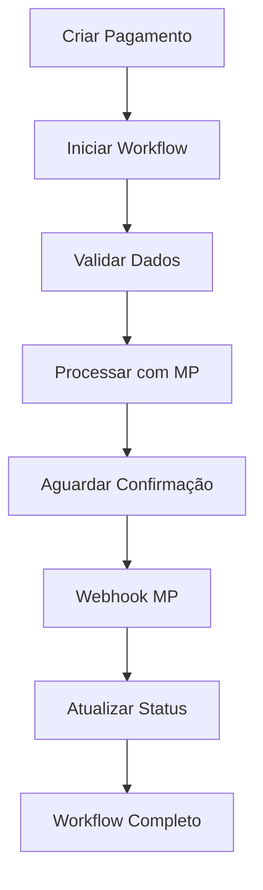

# Payment API - Sistema Avançado de Pagamentos

Uma API **enterprise-ready** para processamento de pagamentos com **autenticação JWT**, **rate limiting**, **cache Redis**, **métricas Prometheus**, **workflows Temporal.io** e **documentação OpenAPI completa**.

## 🚀 Funcionalidades

- 🔐 **Autenticação JWT** - Sistema completo de login/registro
- 💳 **Integração Mercado Pago** - Processamento de pagamentos PIX e cartão de crédito
- 🔄 **Temporal.io Workflows** - Processamento robusto de pagamentos com durabilidade
- 📡 **Webhooks Inteligentes** - Atualização automática de status via Mercado Pago
- 🔍 **Filtros Avançados** - Busca por CPF, método de pagamento e status
- 🚀 **Rate Limiting** - Proteção contra abuso com configuração flexível
- 📊 **Cache Redis** - Cache distribuído para alta performance
- 📈 **Monitoramento** - Métricas com Prometheus e dashboards Grafana
- 🐳 **Docker** - Ambiente completamente containerizado
- 📖 **Documentação** - API totalmente documentada com Swagger UI
- 🏥 **Health Checks** - Monitoramento de saúde de todos os serviços

## 🏃‍♂️ Quick Start

### 1. Clone e Configure

```bash
git clone https://github.com/rogeriobatista/payment-api.git
cd payment-api

# Configure o ambiente
cp .env.example .env
# Edite o .env conforme necessário
```

### 2. Execute com Docker (Recomendado)

```bash
# Ambiente de desenvolvimento (com hot reload)
docker compose -f docker-compose.dev.yml up -d

# Verifique se todos os serviços estão rodando
docker compose -f docker-compose.dev.yml ps
```

### 3. Acesse a Aplicação

- **API**: http://localhost:3000
- **Documentação Swagger**: http://localhost:3000/api/docs
- **Adminer (PostgreSQL)**: http://localhost:8080
- **Redis Commander**: http://localhost:8081

## 📖 Como Usar a API

### 1. Registrar um Usuário

```bash
curl -X POST http://localhost:3000/auth/register \
  -H "Content-Type: application/json" \
  -d '{
    "email": "usuario@exemplo.com",
    "password": "senha123",
    "roles": ["user"]
  }'
```

**Resposta:**
```json
{
  "message": "User created successfully",
  "user": {
    "id": "1",
    "email": "usuario@exemplo.com",
    "roles": ["user"]
  },
  "access_token": "eyJhbGciOiJIUzI1NiIsInR5cCI6IkpXVCJ9..."
}
```

### 2. Fazer Login

```bash
curl -X POST http://localhost:3000/auth/login \
  -H "Content-Type: application/json" \
  -d '{
    "email": "usuario@exemplo.com",
    "password": "senha123"
  }'
```

### 3. Acessar Endpoints Protegidos

```bash
# Use o token recebido no login/registro
curl -X GET http://localhost:3000/api/payment \
  -H "Authorization: Bearer SEU_TOKEN_JWT"
```

### 4. Criar um Pagamento

```bash
curl -X POST http://localhost:3000/api/payment \
  -H "Authorization: Bearer SEU_TOKEN_JWT" \
  -H "Content-Type: application/json" \
  -d '{
    "cpf": "11144477735",
    "description": "Compra de produto",
    "amount": 10000,
    "paymentMethod": "CREDIT_CARD"
  }'
```

**Resposta:**
```json
{
  "payment": {
    "id": "20958000-a265-4bf0-adee-162a1cfc72e8",
    "cpf": "11144477735",
    "description": "Compra de produto",
    "amount": 10000,
    "paymentMethod": "CREDIT_CARD",
    "status": "PENDING",
    "createdAt": "2025-11-09T19:06:14.010Z",
    "updatedAt": "2025-11-09T19:06:13.986Z"
  },
  "workflow_id": "payment-20958000-a265-4bf0-adee-162a1cfc72e8-1762715174010"
}
```

### 5. Filtrar Pagamentos

```bash
# Filtrar por CPF
curl -X GET "http://localhost:3000/api/payment?cpf=11144477735" \
  -H "Authorization: Bearer SEU_TOKEN_JWT"

# Filtrar por CPF formatado
curl -X GET "http://localhost:3000/api/payment?cpf=111.444.777-35" \
  -H "Authorization: Bearer SEU_TOKEN_JWT"

# Filtrar por múltiplos critérios
curl -X GET "http://localhost:3000/api/payment?cpf=11144477735&paymentMethod=CREDIT_CARD&status=PENDING" \
  -H "Authorization: Bearer SEU_TOKEN_JWT"
```

### 6. Webhook do Mercado Pago

O sistema processa automaticamente webhooks do Mercado Pago para atualizar status de pagamentos:

```bash
# Exemplo de webhook (enviado automaticamente pelo Mercado Pago)
curl -X POST http://localhost:3000/api/webhook/mercado-pago \
  -H "Content-Type: application/json" \
  -d '{
    "id": 12345,
    "live_mode": false,
    "type": "payment",
    "action": "payment.approved",
    "data": {
      "id": "payment_id_do_mercado_pago"
    }
  }'
```

## 🐳 Docker & Ambientes

### Desenvolvimento (`docker-compose.dev.yml`)

- **Hot reload** ativado via volume binding
- **Ferramentas de debug** incluídas
- **Adminer** para PostgreSQL (http://localhost:8080)
- **Redis Commander** para Redis (http://localhost:8081)
- **Monitoramento opcional** com `--profile monitoring`

```bash
# Iniciar ambiente de desenvolvimento
docker compose -f docker-compose.dev.yml up -d

# Ver logs
docker compose -f docker-compose.dev.yml logs -f

# Parar ambiente
docker compose -f docker-compose.dev.yml down
```

### Produção (`docker-compose.prod.yml`)

- **Build otimizado** para produção
- **Stack completo** incluindo Nginx proxy
- **Health checks** em todos os serviços
- **Monitoring integrado** (Prometheus + Grafana)

```bash
# Build e deploy para produção
docker compose -f docker-compose.prod.yml build
docker compose -f docker-compose.prod.yml up -d

# Monitoramento (opcional)
docker compose -f docker-compose.prod.yml --profile monitoring up -d
```

## 📚 Documentação da API

A documentação completa da API está disponível via Swagger UI:

**URL**: http://localhost:3000/api/docs

### Principais Endpoints

#### Autenticação
- `POST /auth/register` - Registrar novo usuário
- `POST /auth/login` - Fazer login
- `GET /auth/profile` - Obter perfil do usuário
- `POST /auth/refresh` - Renovar token

#### Pagamentos
- `GET /api/payment` - Listar pagamentos (com filtros por CPF, método, status)
- `POST /api/payment` - Criar pagamento (inicia workflow Temporal para CREDIT_CARD)
- `GET /api/payment/:id` - Obter pagamento específico
- `PUT /api/payment/:id` - Atualizar pagamento

#### Webhooks
- `POST /api/webhook/mercado-pago` - Webhook do Mercado Pago (atualiza status automaticamente)

#### Monitoramento
- `GET /health` - Health check geral
- `GET /metrics` - Métricas Prometheus

## 🏗️ Arquitetura

### Stack Tecnológico

- **Runtime**: Node.js 20 + TypeScript
- **Framework**: NestJS
- **Banco de Dados**: PostgreSQL 12
- **Cache**: Redis 7
- **Workflows**: Temporal.io
- **Documentação**: Swagger/OpenAPI
- **Monitoramento**: Prometheus + Grafana
- **Containerização**: Docker + Docker Compose

### Estrutura do Projeto

```
src/
├── auth/                   # Sistema de autenticação
│   ├── controllers/
│   ├── services/
│   ├── guards/
│   ├── strategies/
│   └── dto/
├── presentation/           # Controllers e DTOs
│   └── controllers/
├── application/           # Use cases e business logic
│   └── use-cases/
├── domain/               # Entidades e repositories
│   ├── entities/
│   └── repositories/
├── infrastructure/       # Implementações externas
│   ├── database/
│   ├── repositories/
│   └── services/
├── workflows/            # Temporal.io workflows e activities
│   ├── activities/
│   ├── types/
│   └── temporal.service.ts
├── rate-limit/          # Rate limiting
├── logging/             # Sistema de logs
└── main.ts             # Bootstrap da aplicação
```

### Fluxo de Pagamento com Temporal.io

O sistema utiliza Temporal.io para garantir que os pagamentos sejam processados de forma robusta:

1. **Criação**: Pagamento criado e workflow iniciado
2. **Processamento**: Integração com Mercado Pago via activities
3. **Monitoramento**: Workflow aguarda confirmação ou timeout
4. **Webhook**: Mercado Pago notifica mudanças de status
5. **Finalização**: Status atualizado e workflow completado


```mermaid
graph TD
    A[Criar Pagamento] --> B[Iniciar Workflow]
    B --> C[Validar Dados]
    C --> D[Processar com MP]
    D --> E[Aguardar Confirmação]
    E --> F[Webhook MP]
    F --> G[Atualizar Status]
    G --> H[Workflow Completo]
```

## ⚙️ Configuração

### Variáveis de Ambiente

Copie o arquivo `.env.example` para `.env` e configure:

```bash
# Aplicação
NODE_ENV=development
PORT=3000

# Banco de Dados
DB_HOST=localhost
DB_PORT=5432
DB_USERNAME=postgres
DB_PASSWORD=postgres
DB_NAME=payment_api

# Autenticação
JWT_SECRET=your-super-secret-jwt-key-min-32-characters
JWT_EXPIRES_IN=24h

# Redis
REDIS_HOST=localhost
REDIS_PORT=6379
REDIS_PASSWORD=

# Temporal
TEMPORAL_ADDRESS=localhost:7233
TEMPORAL_NAMESPACE=default

# Mercado Pago
MERCADO_PAGO_ACCESS_TOKEN=TEST-your_access_token_here
MERCADO_PAGO_PUBLIC_KEY=TEST-your_public_key_here
MERCADO_PAGO_WEBHOOK_URL=http://localhost:3000/api/webhook/mercado-pago
MERCADO_PAGO_SUCCESS_URL=http://localhost:3000/payment/success
MERCADO_PAGO_FAILURE_URL=http://localhost:3000/payment/failure
MERCADO_PAGO_PENDING_URL=http://localhost:3000/payment/pending

# Rate Limiting
THROTTLE_TTL=60000
THROTTLE_LIMIT=100

# Logging
LOG_LEVEL=info
```

### Configuração do Mercado Pago

1. Acesse o [Mercado Pago Developers](https://www.mercadopago.com.br/developers)
2. Crie uma aplicação
3. Obtenha suas credenciais de teste
4. Configure no `.env`:
   ```bash
   MERCADO_PAGO_ACCESS_TOKEN=TEST-sua_credencial_aqui
   MERCADO_PAGO_PUBLIC_KEY=TEST-sua_chave_publica_aqui
   MERCADO_PAGO_WEBHOOK_URL=http://seu-dominio.com/api/webhook/mercado-pago
   ```

### ⚠️ Importantes Considerações de Produção

#### Temporal.io Worker
O worker Temporal pode apresentar problemas com bibliotecas nativas. Para produção:

```bash
# Se o worker falhar, você pode desabilitar temporariamente
docker compose -f docker-compose.dev.yml stop payment-worker

# O sistema continuará funcionando, mas sem workflows Temporal
# Os pagamentos serão atualizados apenas via webhook

# Para executar worker localmente em produção
npm run build
npm run worker
```

#### Banco de Dados e Migrations

O projeto utiliza TypeORM para gerenciamento do banco de dados:

```bash
# Executar migrations pendentes
npm run typeorm migration:run

# Reverter última migration
npm run typeorm migration:revert

# Gerar nova migration
npm run typeorm migration:generate -- -n NomeDaMigration

# Criar migration vazia
npm run typeorm migration:create -- -n NomeDaMigration

# Ver status das migrations
npm run typeorm migration:show

# Sincronizar schema (CUIDADO em produção!)
npm run typeorm schema:sync
```

#### Webhook do Mercado Pago
Para receber webhooks em produção, configure:

1. **URL pública**: Configure `MERCADO_PAGO_WEBHOOK_URL` com sua URL pública
2. **HTTPS**: Mercado Pago requer HTTPS em produção
3. **Timeout**: Webhooks têm timeout de 10 segundos

## 🚀 Deploy em Produção

### Docker Compose (Recomendado)

```bash
# 1. Clone e configure
git clone https://github.com/rogeriobatista/payment-api.git
cd payment-api
cp .env.example .env

# 2. Configure variáveis de produção
nano .env  # Configure com credenciais reais

# 3. Build e deploy
docker compose -f docker-compose.prod.yml build
docker compose -f docker-compose.prod.yml up -d

# 4. Verificar status
docker compose -f docker-compose.prod.yml ps
```

### Kubernetes (Helm)

```bash
# TODO: Implementar charts Helm
helm install payment-api ./charts/payment-api
```

## 📊 Monitoramento

### Health Checks

A aplicação possui health checks abrangentes:

```bash
curl http://localhost:3000/health
```

**Resposta:**
```json
{
  "status": "ok",
  "info": {
    "database": { "status": "up" },
    "redis": { "status": "up" },
    "temporal": { "status": "up" }
  }
}
```

### Métricas Prometheus

```bash
curl http://localhost:3000/metrics
```

### Dashboards Grafana

Acesse: http://localhost:3001 (com `--profile monitoring`)

- **Usuário**: admin
- **Senha**: admin

## 🔧 Desenvolvimento

### Pré-requisitos

- Node.js 20+
- Docker & Docker Compose
- Git

### Setup Local

```bash
# 1. Clone o projeto
git clone https://github.com/rogeriobatista/payment-api.git
cd payment-api

# 2. Instale dependências
npm install

# 3. Configure ambiente
cp .env.example .env

# 4. Inicie serviços Docker
docker compose -f docker-compose.dev.yml up -d postgres redis temporal

# 5. Execute em modo desenvolvimento
npm run start:dev

# 6. (Opcional) Execute o worker Temporal em outro terminal
npm run worker:dev
```

### Desenvolvimento Sem Docker

Se preferir executar localmente sem Docker:

```bash
# 1. Configure o ambiente local
cp .env.example .env
# Edite .env com configurações locais

# 2. Execute API em desenvolvimento
npm run start:dev

# 3. Execute worker Temporal (em outro terminal)
npm run worker:dev

# 4. Execute testes
npm run test

# 5. Execute testes com watch
npm run test:watch

# 6. Verificar cobertura de testes
npm run test:coverage
```

### Scripts Disponíveis

Todos os scripts estão detalhados na seção **Scripts NPM Detalhados** mais abaixo neste documento.

### Exemplo de Uso dos Scripts

```bash
# Para desenvolvimento completo (API + Worker)
npm run start:dev      # Terminal 1: API
npm run worker:dev     # Terminal 2: Worker Temporal

# Para produção
npm run build          # Build do projeto
npm run start          # Terminal 1: API em produção
npm run worker         # Terminal 2: Worker em produção

# Para executar migrations
npm run typeorm migration:run
npm run typeorm migration:revert
```

### Estrutura de Comandos Docker

```bash
# Desenvolvimento
docker compose -f docker-compose.dev.yml up -d    # Iniciar
docker compose -f docker-compose.dev.yml down     # Parar
docker compose -f docker-compose.dev.yml logs -f  # Ver logs

# Produção
docker compose -f docker-compose.prod.yml build   # Build
docker compose -f docker-compose.prod.yml up -d   # Deploy
docker compose -f docker-compose.prod.yml ps      # Status

# Utilitários
docker compose -f docker-compose.dev.yml exec payment-api bash  # Acessar container
docker compose -f docker-compose.dev.yml restart payment-api    # Reiniciar serviço
```

## 🚨 Troubleshooting

### Problemas Comuns

#### 1. Worker Temporal não inicia
```bash
# Erro: Library loading failed
# Solução: Remover/reconstruir container
docker compose -f docker-compose.dev.yml down payment-worker
docker compose -f docker-compose.dev.yml build payment-worker
docker compose -f docker-compose.dev.yml up -d payment-worker

# Alternativa: Executar worker localmente
npm run worker:dev

# Ou executar sem worker (sistema funcionará via webhook)
docker compose -f docker-compose.dev.yml stop payment-worker
```

#### 2. Erro de build ou start
```bash
# Limpar build anterior e rebuildar
rm -rf dist/
npm run build

# Verificar se o build foi bem-sucedido
ls -la dist/

# Executar em produção após build
npm run start

# Se houver erro de TypeScript
npx tsc --noEmit  # Verificar erros de tipo
```

#### 3. Problemas com migrations
```bash
# Verificar status das migrations
npm run typeorm migration:show

# Executar migrations pendentes
npm run typeorm migration:run

# Se migration falhar, verificar logs do banco
docker compose -f docker-compose.dev.yml logs postgres
```

#### 4. Conexão com Mercado Pago falha
```bash
# Verificar credenciais no .env
echo $MERCADO_PAGO_ACCESS_TOKEN

# Testar conexão
curl -H "Authorization: Bearer $MERCADO_PAGO_ACCESS_TOKEN" \
  https://api.mercadopago.com/v1/payment_methods
```

#### 5. Banco de dados não conecta
```bash
# Verificar status dos containers
docker compose -f docker-compose.dev.yml ps

# Reiniciar PostgreSQL
docker compose -f docker-compose.dev.yml restart postgres

# Ver logs do banco
docker compose -f docker-compose.dev.yml logs postgres
```

#### 6. API retorna 404
```bash
# Verificar se API está rodando
curl http://localhost:3000/health

# Verificar rotas no Swagger
open http://localhost:3000/api/docs
```

#### 7. Webhook não é processado
```bash
# Verificar logs da API
docker compose -f docker-compose.dev.yml logs payment-api | grep webhook

# Testar webhook manualmente
curl -X POST "http://localhost:3000/api/webhook/mercado-pago" \
  -H "Content-Type: application/json" \
  -d '{"type": "payment", "action": "payment.approved", "data": {"id": "test"}}'
```

### Logs Importantes

```bash
# Logs da API
docker compose -f docker-compose.dev.yml logs payment-api -f

# Logs do Worker
docker compose -f docker-compose.dev.yml logs payment-worker -f

# Logs do Temporal
docker compose -f docker-compose.dev.yml logs temporal -f

# Todos os logs
docker compose -f docker-compose.dev.yml logs -f
```

### Reset Completo

Se nada funcionar, reset completo:

```bash
# 1. Parar tudo
docker compose -f docker-compose.dev.yml down -v

# 2. Limpar volumes
docker volume prune -f

# 3. Rebuild
docker compose -f docker-compose.dev.yml build --no-cache

# 4. Iniciar novamente
docker compose -f docker-compose.dev.yml up -d
```

## 🧪 Testes

### Executar Testes

```bash
# Testes unitários (execução única)
npm run test

# Testes em modo watch (re-executa automaticamente)
npm run test:watch

# Testes com relatório de cobertura
npm run test:coverage
```

### Testes com Docker

```bash
# Executar testes no container
docker compose -f docker-compose.dev.yml exec payment-api npm test

# Executar testes com cobertura no container
docker compose -f docker-compose.dev.yml exec payment-api npm run test:coverage

# Executar testes em modo watch no container
docker compose -f docker-compose.dev.yml exec payment-api npm run test:watch
```

### 🔬 Teste de Integração Completa

Para verificar se todo o fluxo está funcionando:

#### 1. Teste de Pagamento com Workflow

```bash
# 1. Criar pagamento com cartão de crédito (inicia workflow)
curl -X POST "http://localhost:3000/api/payment" \
  -H "Content-Type: application/json" \
  -d '{
    "cpf": "11144477735",
    "description": "Teste workflow",
    "amount": 10000,
    "paymentMethod": "CREDIT_CARD"
  }'

# Anote o "id" e "workflow_id" retornados
```

#### 2. Simular Webhook de Aprovação

```bash
# 2. Simular webhook do Mercado Pago
curl -X POST "http://localhost:3000/api/webhook/mercado-pago" \
  -H "Content-Type: application/json" \
  -d '{
    "type": "payment",
    "action": "payment.approved",
    "data": {
      "id": "SEU_PAYMENT_ID_AQUI"
    }
  }'
```

#### 3. Verificar Status Atualizado

```bash
# 3. Verificar se status foi atualizado para PAID
curl -X GET "http://localhost:3000/api/payment?cpf=11144477735"
```

#### 4. Teste de Filtros

```bash
# Teste filtros avançados
curl -X GET "http://localhost:3000/api/payment?cpf=111.444.777-35&paymentMethod=CREDIT_CARD&status=PAID"
```

### 📊 Verificação de Logs

```bash
# Ver logs da API
docker compose -f docker-compose.dev.yml logs payment-api -f

# Ver logs do Worker Temporal
docker compose -f docker-compose.dev.yml logs payment-worker -f
```

## ⚙️ Scripts NPM Detalhados

### Desenvolvimento e Build
```bash
# Desenvolvimento com hot reload e TypeScript
npm run start:dev

# Debug mode com nodemon
npm run start:debug

# Build para produção (TypeScript + tsc-alias para paths)
npm run build

# Executar versão de produção compilada
npm run start
```

### Workers Temporal
```bash
# Worker Temporal em desenvolvimento (hot reload)
npm run worker:dev

# Worker Temporal para produção
npm run worker
```

### Testes
```bash
# Testes unitários uma vez
npm run test

# Testes com watch mode (re-executa ao salvar)
npm run test:watch

# Testes com relatório de cobertura
npm run test:coverage
```

### TypeORM Database
```bash
# Comandos gerais do TypeORM
npm run typeorm <comando>

# Exemplos úteis:
npm run typeorm migration:run      # Executar migrations
npm run typeorm migration:revert   # Reverter migration
npm run typeorm migration:show     # Status das migrations
npm run typeorm schema:sync        # Sincronizar schema (dev only)
```

## 🤝 Contribuição

1. Fork o projeto
2. Crie uma branch para sua feature (`git checkout -b feature/AmazingFeature`)
3. Commit suas mudanças (`git commit -m 'Add some AmazingFeature'`)
4. Push para a branch (`git push origin feature/AmazingFeature`)
5. Abra um Pull Request

### Padrões de Código

- Use **TypeScript** para type safety
- Escreva **testes** para novas funcionalidades com Jest
- Execute `npm run test:coverage` para verificar cobertura
- Use **conventional commits** para mensagens de commit
- Documente com **JSDoc** quando necessário
- Execute `npm run build` antes de fazer push para verificar compilação

### Scripts de Verificação

```bash
# Verificar se o código compila sem erros
npm run build

# Executar todos os testes
npm run test

# Verificar cobertura de testes
npm run test:coverage

# Verificar se migrations estão atualizadas
npm run typeorm migration:show
```

## 📝 Licença

Este projeto está licenciado sob a licença MIT - veja o arquivo [LICENSE](LICENSE) para detalhes.

---

**Desenvolvido com ❤️ por [Rogerio Batista](https://github.com/rogeriobatista)**